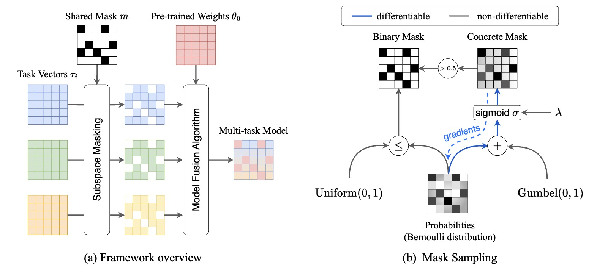

# Flatness-Driven Model Fusion



setup environment 

```bash
# you can replace the name `concrete` with any name you like
conda create --name concrete python=3.11
conda activate concrete
pip install -r requirements.txt # x86-64 Linux
```

## [Experiments](results/README.md)

## Acknowledgements

Some of the code in this repository is based on the following repositories:

- https://github.com/EnnengYang/AdaMerging
- https://github.com/mlfoundations/task_vectors
- https://github.com/prateeky2806/ties-merging
